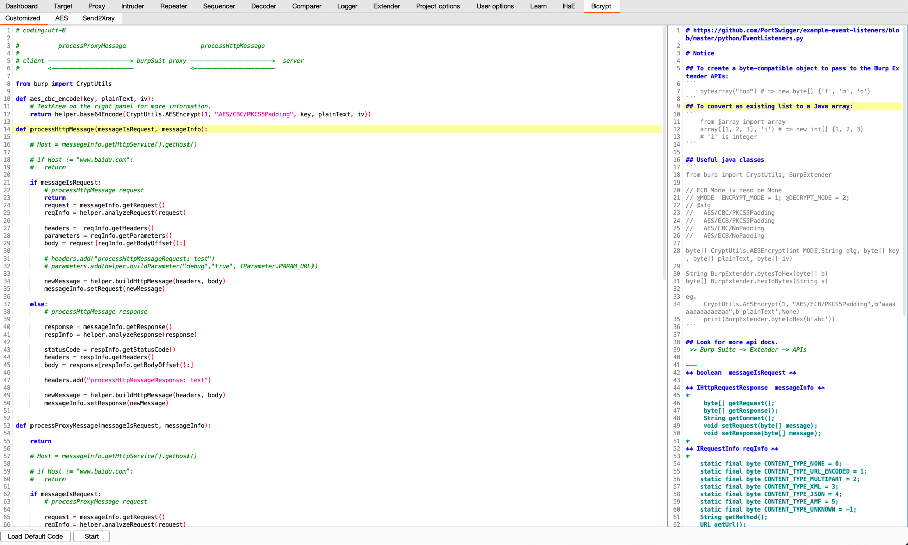
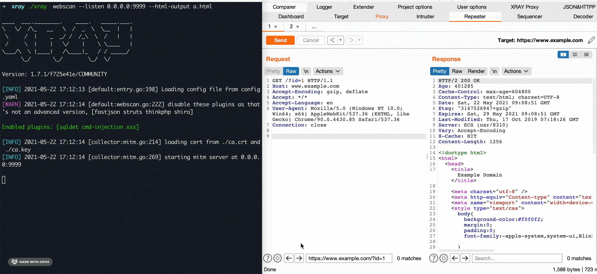

# Bcrypt
This is an extension for Burp Suite，

**Feature:**

* Customized
* AES
* Send2Xray
* Convert Content-Type

### Customized

Execute custom python script，modify HTTP request between the client and server.

```
           processProxyMessage                     processHttpMessage

 client -----------------------> burpSuit proxy ----------------------->  server
        <-----------------------                <-----------------------
```



### AES

Reference [AES-Killer](https://github.com/Ebryx/AES-Killer) and  something enhancement


### Send2Xray

Context menu for Send request message to the specified proxy

Standalone version: https://github.com/cyal1/SendToXray/tree/requests_mode 



### Convert Content-Type

Context Menu for Convert Content-Type


